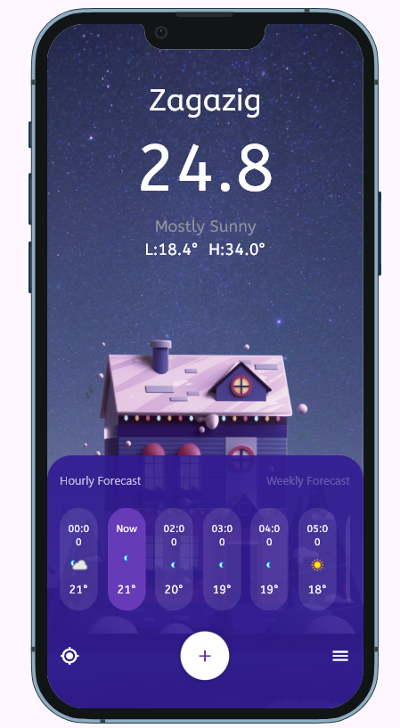
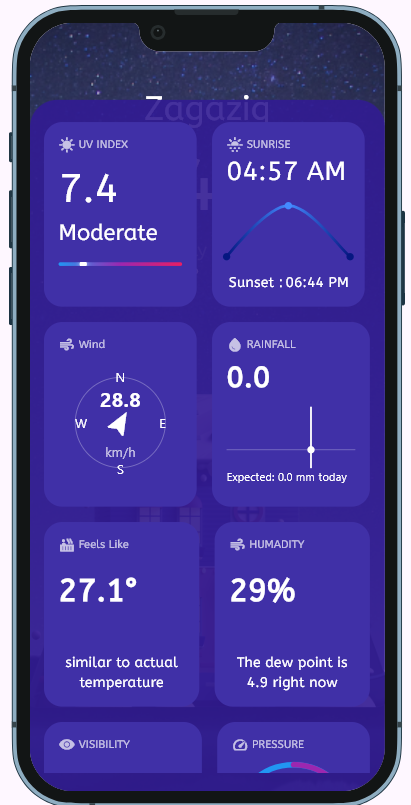
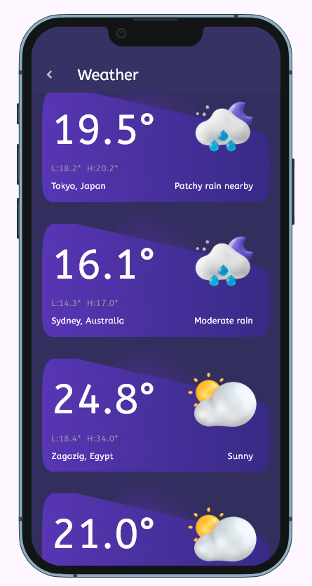
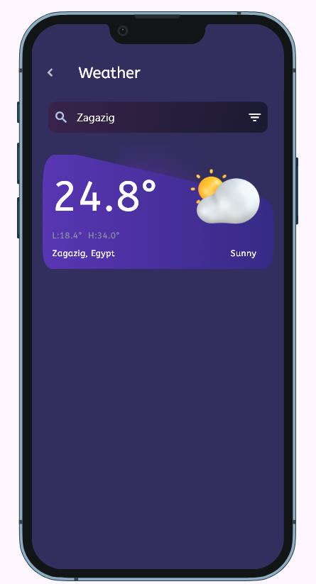

# 🌦️ Weather App

A cross-platform Flutter application that provides real-time weather information for cities worldwide. The app features a modern, responsive UI and leverages state management and API integration for a smooth user experience.

<div align="center">
  
  
</div>

---

## 🚀 Features

- 🔍 Search for weather by city name
- 📍 Get current weather for your location (with permission)
- 🌡️ View temperature, min/max, humidity, wind, and more
- 🖼️ Dynamic weather images (sunny, rainy, cloudy, etc.)
- 📅 14-day weather forecast
- 📱 Responsive design for all screen sizes (using Sizer)
- ⚡ Fast state management with flutter_bloc
- 💾 (Planned) Save favorite cities with SharedPreferences

---

## 📱 Project Structure

```
lib/
  main.dart                # App entry point
  cache/                   # Local cache helpers
  colors/                  # Color palette and constants
  constant/                # App-wide constants (routes, images, etc.)
  core/
    Api/                   # API endpoints and consumers
    errors/                # Error handling
  cubit/                   # Weather Cubit and states (BLoC)
  models/                  # Data models (Weather, Hourly, etc.)
  screens/                 # UI screens (Home, Search, etc.)
  services/                # Weather API service logic
  widgets/
    utils/                 # Utility widgets
    weather_widgets/       # Weather-specific UI components
```

---

## 🧑‍💻 Getting Started

### Prerequisites

- Flutter SDK
- Android Studio or VS Code
- Emulator or device

### Installation

```bash
git clone https://github.com/dinamaher248/weather_app.git
cd weather_app
flutter pub get
flutter run
```

---

## 🌍 API

Weather data is fetched from [WeatherAPI.com](https://www.weatherapi.com/docs/).

---

## 📷 Screenshots

<p align="center"></p>
<p align="center"></p>
<p align="center"></p>
<p align="center"></p>

---

## 💬 Contact

Made with ❤️ by Dina Maher  
Feel free to reach out or contribute!


